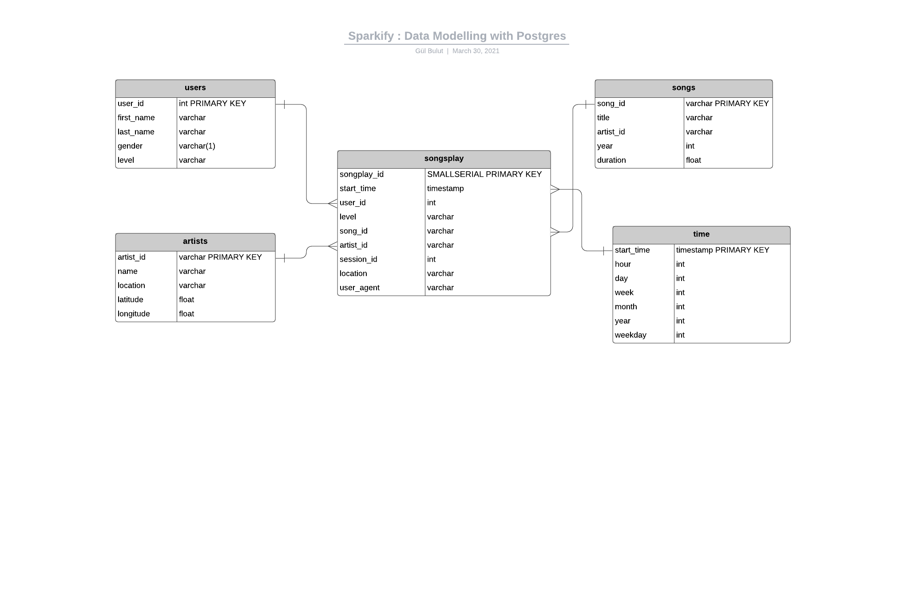

# Sparkify Project: Data Modelling with Postgres

## About the project 
A startup called Sparkify wants to analyze the data they've been collecting on songs and user activity on their new music streaming app.

In this project, I applied what i've learned on data modeling with Postgres and build an ETL pipeline using Python. 

---
## Data

There are two different source file for build an ETL pipeline.

**Song Dataset** : The first dataset is a subset of real data from the Million Song Dataset. Each file is in JSON format and contains metadata about a song and the artist of that song. 
For example:
```
{"num_songs": 1, 
"artist_id": "ARD7TVE1187B99BFB1", 
"artist_latitude": null, 
"artist_longitude": null, 
"artist_location": "California - LA", 
"artist_name": "Casual", 
"song_id": "SOMZWCG12A8C13C480", 
"title": "I Didn't Mean To", 
"duration": 218.93179, 
"year": 0}
```
**Log Dataset** : The second dataset consists of log files in JSON format generated by this event simulator based on the songs in the dataset above.
For example:
```
{"artist":"Survivor",
"auth":"Logged In",
"firstName":"Jayden",
"gender":"M",
"itemInSession":0,
"lastName":"Fox",
"length":245.36771,
"level":"free",
"location":"New Orleans-Metairie, LA",
"method":"PUT",
"page":"NextSong",
"registration":1541033612796.0,
"sessionId":100,
"song":"Eye Of The Tiger",
"status":200,
"ts":1541110994796,
"userAgent":"\"Mozilla\/5.0 (Windows NT 6.3; WOW64) AppleWebKit\/537.36 (KHTML, like Gecko) Chrome\/36.0.1985.143 Safari\/537.36\"",
"userId":"101"}
```

## ERD Schema


## Requirements
- Python3
- Run `pip install requirements.txt `

## How to Use
- Run `python create_tables.py` command to create database and its tables.
- Run `python etl.py` command to complete etl process.

## The End 
